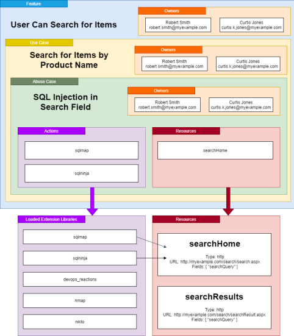

# SMACD data model

The SMACD data model integrates data about your system or application's [**features**](#features), [**use cases**](#use-cases), possible [**abuse cases**](#abuse-cases), [**plugin pointers**](#plugin-pointers) and [**resource pointers**](#resource-pointers).



*The above would be a visual model of the YAML service map description below:*
```yaml
features:
- name: User Can Search for Items
  description: The user can search the product database for records
  owners:
  - name: Robert Smith
    email: robert.smith@myexample.com
  - name: Curtis Jones
    email: curtis.k.jones@myexample.com
  useCases:
  - name: Search for Items by Product Name
    description: The user can search the product database using the 'Name' field
    owners:
    - name: Robert Smith
      email: robert.smith@myexample.com
    - name: Curtis Jones
      email: curtis.k.jones@myexample.com
    abuseCases:
    - name: SQL Injection in Search Field
      description: An attacker can manipulate the search field to SQL inject the application
      actions:
      - action: sqlmap
        target:
          targetId: searchHome
      - action: sqlninja
        target:
          targetId: searchHome
targets:
- !http
  targetId: searchHome
  url: http://myexample.com/search/search.aspx
  fields:
    searchQuery: ""
- !http
  targetId: searchResults
  url: http://myexample.com/search/searchResult.aspx
  fields:
    searchQuery: ""
```

---

The following data modelling terms are used in the SMACD CLI tool:

## Features

Features are when groups of use cases result in a functionality or capability within an application. 

For example, a "search inventory" feature.

## Use cases

Use cases are the basis of workflows that a user follows in order to accomplish some task. These are usually implemented as features.

For example, to implement a "search inventory" feature, you might need to:

1. Register a user
2. Log in a user
3. Gather the current inventory
4. Correlate a search term with a product ID
5. Search the current inventory for that product ID's availability

## Abuse cases

Abuse cases are workflows that an attacker can use to manipulate a use case into performing an unintended task. Frequently, these unintended tasks are malicious ways to get a foothold to further attack the application.

For example, to abuse a "search inventory" feature, a malicious actor might perform a SQL injection in the search form.

## Actions

Actions are extensions to the SMACD CLI tool which provide functionality to test or otherwise generate information about a given target. This target can be any part of the application. Part of specifying an action to take also involves specifying a [target resource](#target-resources) to the resource being used by the plugin.

## Target resources

Target Resources are data structures that represent the information required to access a specific type of service. This includes a target identifier, the type of resource being identified, and parameters to access the resource.
