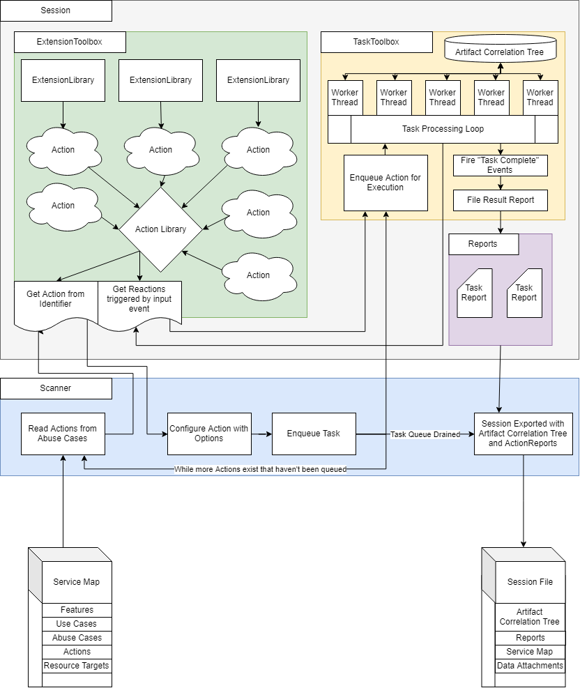

# SMACD scanner workflow

The SMACD scanner workflow is as follows:

1. Load the **service map**
2. Load the service map's contents. These include:
   1. **Features**
   2. **Use cases**
   3. **Abuse cases**
   4. **Plugin pointers**
3. For each plugin pointer, look up the actual loaded **plugin instance**.
4. Validate the **plugin pointer** using the plugin instance.
   1. Ensure that the required options are provided.
   2. Ensure that the **resource pointer** provided can be consumed by the plugin.
5. **Queue** an execution of the plugin with the task manager's task queue.
6. **Execute** the queued plugin. (If there is a consumer of an event that indicates a task is being started, notify that consumer.)
7. Place artifacts in a given **working directory** when the plugin executes.
8. Executed plugin **completes**. (Notify any consumers subscribed to the event that indicates a task has completed.)
9. When all plugins have completed, **iterate** over each result object. Run operations to summarize the content of all reports and generate a risk score.
10. Generate **summary report**. This contains:
    1. All result objects
    2. A generalized list of vulnerabilities
    3. Scores for each result
    4. Any resources that were generated during a spider operation (not provided on the resource map)

