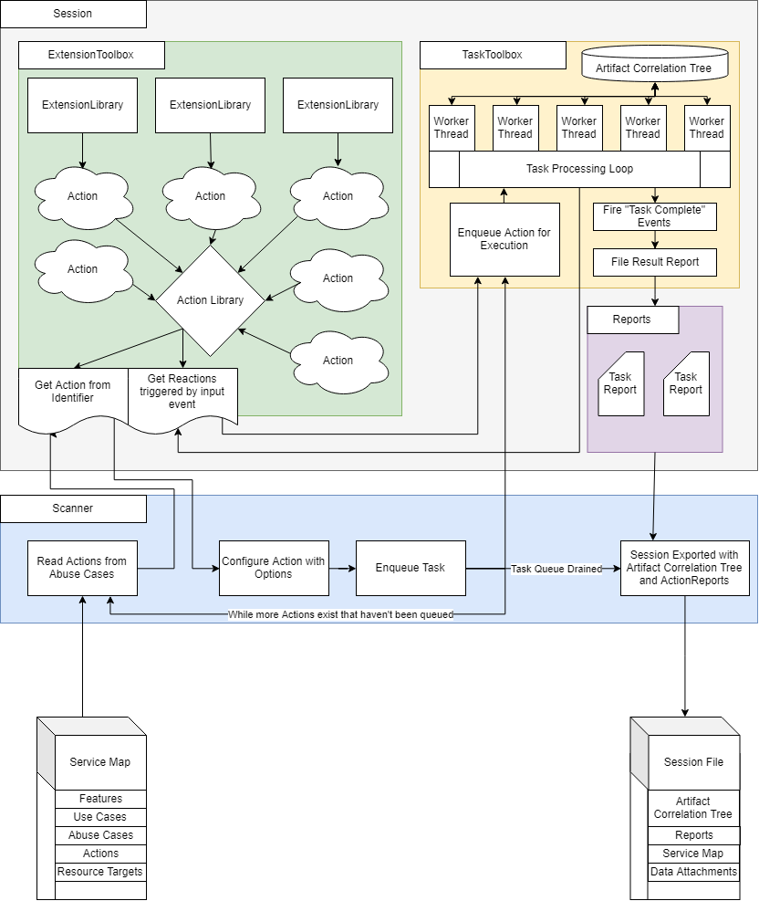

# SMACD scanner workflow

The SMACD scanner workflow is as follows:

1. Load the **service map**
2. Load the service map's contents. These include:
   1. **Features**
   2. **Use cases**
   3. **Abuse cases**
   4. **Actions**
3. Retrieve the **action** from the **ExtensionToolbox** by its **action identifier**. These will have been loaded by the ExtensionToolbox at program start. Part of this initialization includes running the `Initialize` and `ValidateEnvironmentReadiness` commands to ensure compatibility.
4. Validate the **action** is ready to be executed.
   1. Ensure that the required options are provided.
   2. Ensure that the **resource target** specified can be consumed by the action.
5. **Queue** an execution of the action with the task manager's task queue.
6. **Execute** the queued action. (If there is a consumer of an event that indicates a task is being started, notify that consumer.)
7. The action generates an **action-specific report**, as well as modifying/creating nodes on the **artifact correlation tree**.
8. **Triggers**, representing asynchronous events that occur during an action's runtime, are generated based on the action's behavior. These are submitted to the ExtensionToolbox to get a list of **Reactions**, extensions which respond to a specific event. These generated reactions are placed on the task queue, if appropriate.
9. Executed action  **completes**. (Notify any consumers subscribed to the event that indicates a task has completed.)
10. When all actions have completed, and the task queue is drained of any remaining reactions, **iterate** over each result object. Run operations to summarize the content of all reports and generate a risk score.
10. Generate **session file**. This (*non-human-readable*) file contains:
    1. All action-specific **reports, including scores**
    2. A copy of the **Service Map** the session is attached to
    3. Any **data attachments** generated during the scanning process
    4. The **artifact correlation tree**

